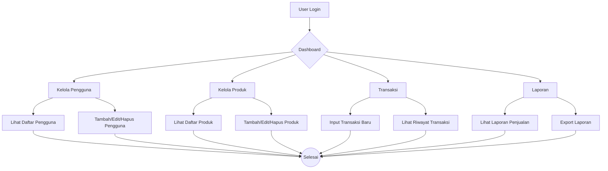

```mermaid
flowchart TD
    A[User Login] --> B{Dashboard}
    B --> C[Kelola Pengguna]
    B --> D[Kelola Produk]
    B --> E[Transaksi]
    B --> F[Laporan]

    C --> C1[Lihat Daftar Pengguna]
    C --> C2[Tambah/Edit/Hapus Pengguna]
    C1 --> Z[Selesai]
    C2 --> Z

    D --> D1[Lihat Daftar Produk]
    D --> D2[Tambah/Edit/Hapus Produk]
    D1 --> Z
    D2 --> Z

    E --> E1[Input Transaksi Baru]
    E --> E2[Lihat Riwayat Transaksi]
    E1 --> Z
    E2 --> Z

    F --> F1[Lihat Laporan Penjualan]
    F --> F2[Export Laporan]
    F1 --> Z
    F2 --> Z

    Z((Selesai))
```
